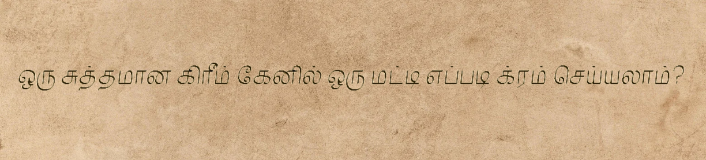

# Alliterative Kākitam
Category: AVERAGE, `1299` points

Category: **Language Translation**

I found an old paper in a Buddhist temple. What's the paper trying to *articulate*? 

Format: RETROTECH{word1_word2}

# Solution

1. Use camera-based OCR like Google Translate or existing and working online OCRs.

2. When you scan it, it's a tongue twister phrase, _"How can a clam cram in a clean cream can?"_

3. Hence, the answer is tongue twister. Following the format:

**Flag:** `RETROTECH{tongue_twister}`