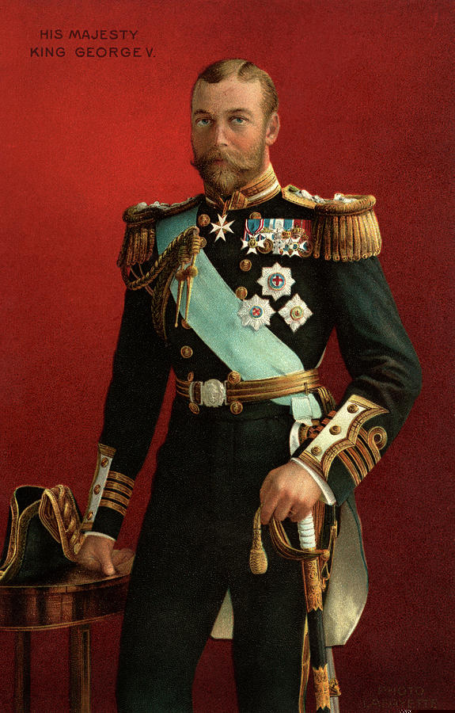
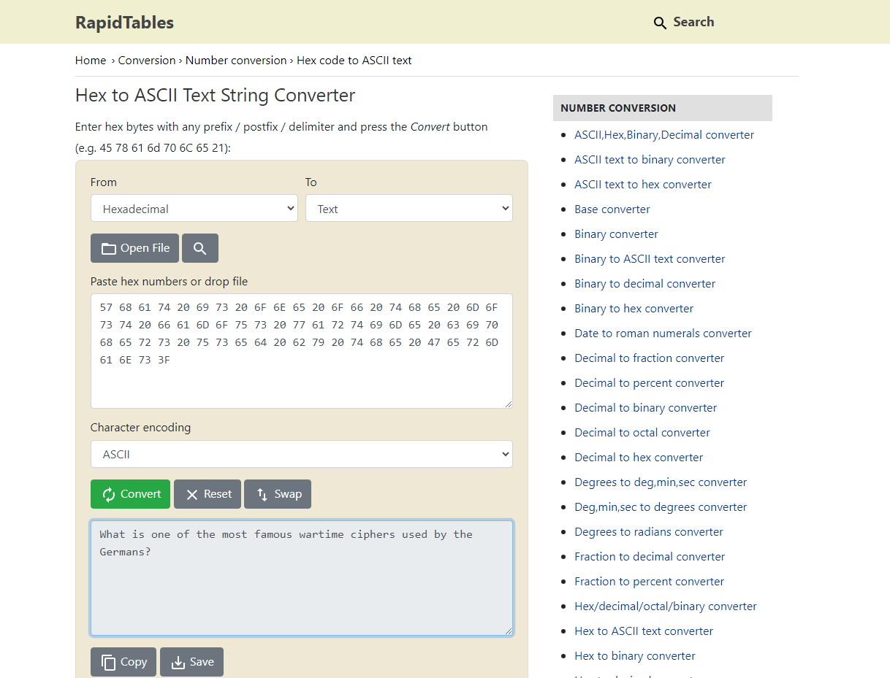

# Axis Encrypted Secrets
Category: Average, `1000` points

During World War II, the Nazi forces used a notorious cipher to encode their messages. You want to know the wartime mystery. You went to ask the CIA, but you received a seemingly safe **image file of King George V** instead. What might be inside of the image file? 



# Solution

1. Using hexed.it, the image file contains the question in its **hex dump**:

```
57 68 61 74 20 69 73 20 6F 6E 65 20 6F 66 20 74 68 65 20 6D 6F 73 74 20 66 61 6D 6F 75 73 20 77 61 72 74 69 6D 65 20 63 69 70 68 65 72 73 20 75 73 65 64 20 62 79 20 74 68 65 20 47 65 72 6D 61 6E 73 3F
```

2. Decrypt it using online decryptors.



3. The flag is the answer to the question.

**Flag:** `RETROTECH{adfgvx}`