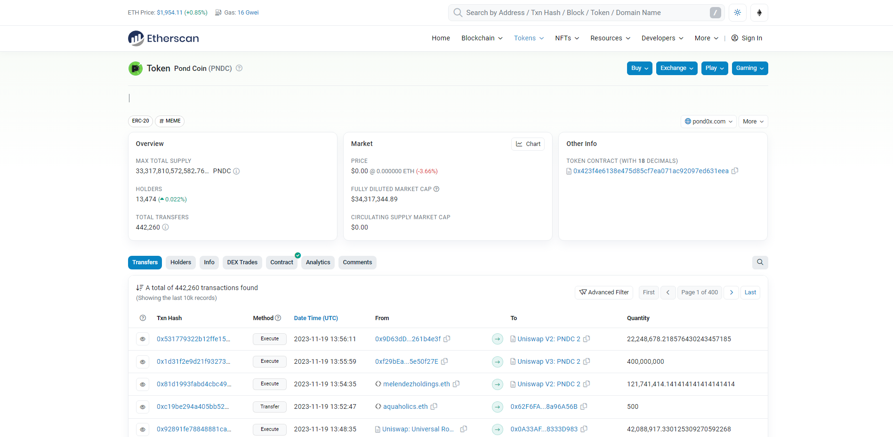

# DeFi Police
DeFi - Decentralized Finance
Category: HARD, `2799` points

You are part of a team of recon investigators tasked with tracking down a cybercriminal who has been using cryptocurrency to launder money. All we know is that they are endorsing an alleged scam coin coded $PNDC and they bought a staggering amount of 19,200,194.82 PNDC tokens that day just before lunchtime. Find out about the transaction and get the transaction hash. 

# Solution

1. Blockchain transactions, by default, is publicly available. There are multiple swapping and trading web application protocols in DeFi, particularly [Uniswap](https://uniswap.org/), [0xProtocol](https://0x.org/), [Oasis](https://oasisprotocol.org/), and more.

2. $PNDC or Pond Coin, by using OSINT, is found out to be a recently developed token. (See CoinGecko)

3. [Etherscan](https://etherscan.io/) is available for use with Ethereum and Binance Chain, and is a great platform to quickly see what is going on with a token.

4. Search for Pond Coin ($PNDC) and look for the transaction history. Go to advanced filter and click the Filter by Amount.

5. Since the token is around 19,200,194.82 PNDC, it's best to use a range amount of 19,200,193 to 19,200,195 to filter out other transactions.

6. We see the transaction result. The flag is the Txn hash.

**Flag:** `RETROTECH{0xf2339adb5117e36ce1638a5b9fcd5adfe179f338a08638846df325f2d14b41ad}`