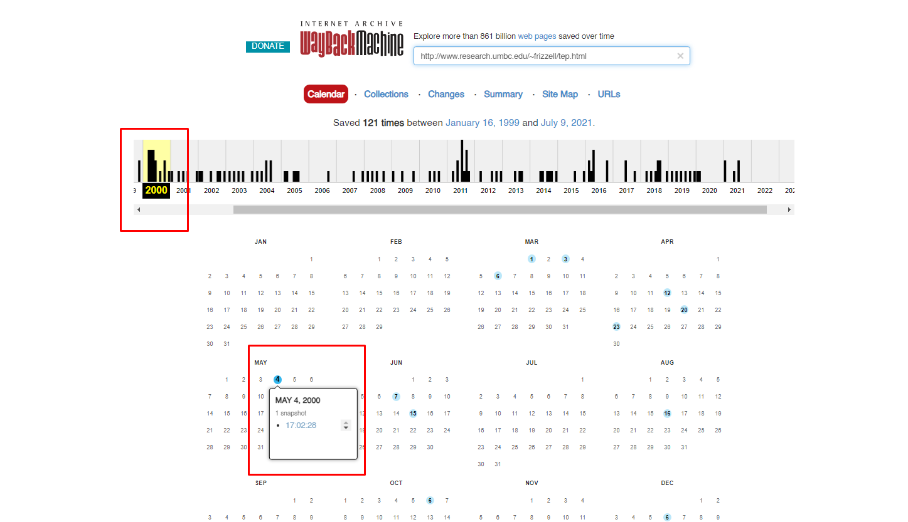
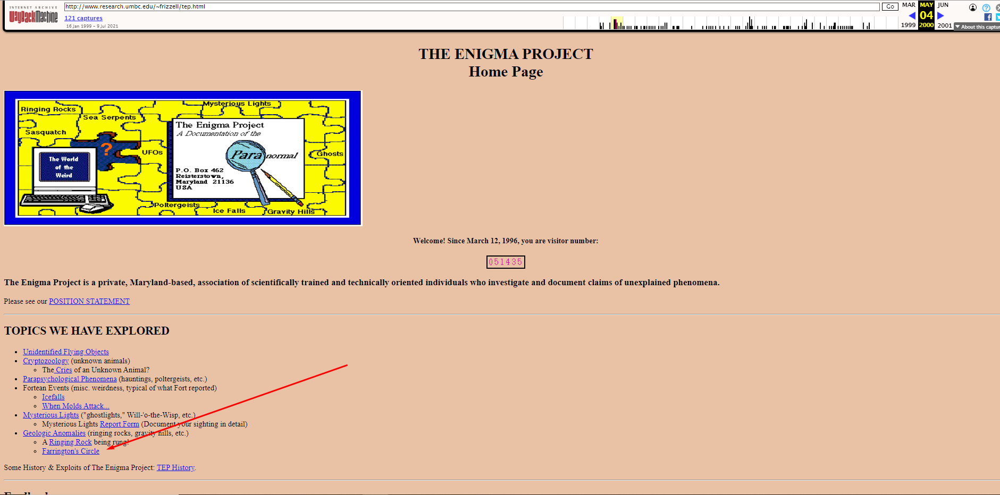
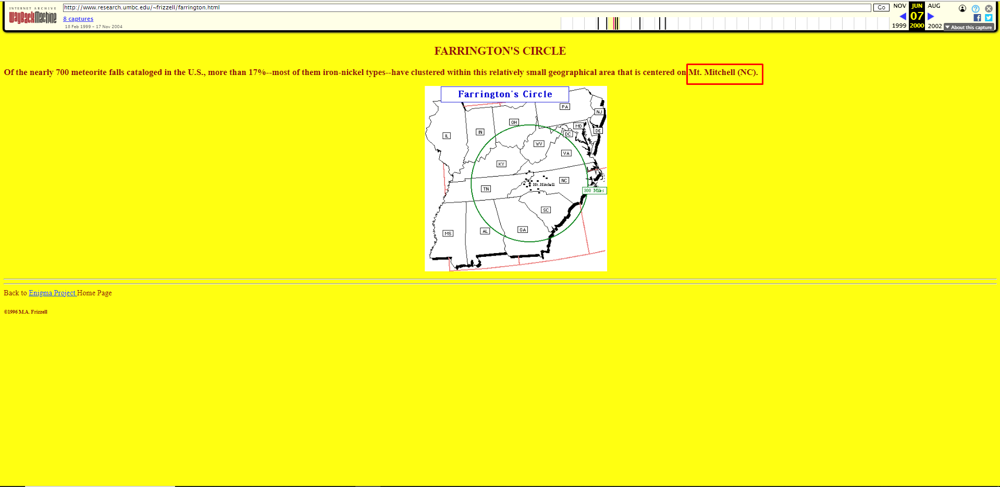

# Enigma of Celestial Bodies
Category: AVERAGE, `1175` points

Skim through the web site to find the flag in the Farrington's Circle phenomenon.

http://www.research.umbc.edu/~frizzell/tep.html

Format: `RETROTECH{Latitude, Longitude}`

# Solution

1. Note that the format mentioned above is a CLUE to the flag. We're finding the coordinates of a location in Farrington's Circle. The website is not available if searching for it right away. You need to use Web Archive.

2. Look for the available date of snapshot of the website.

3. On entering, you see Farrington's Circle. Click it and find the picture.

4. Since the geographical area is centered on Mt. Mitchell in North Carolina, the coordinates is the coordinates of Mt. Mitchell. Google: Latitude and longitude coordinates are: `35.772961, -82.264328`. Mount Mitchell State Park is one of the most famous state parks offering camping and hiking opportunities located in Burnsville, the western part of North Carolina, the United States.

**Flag:** `RETROTECH{35.772961,-82.264328}`