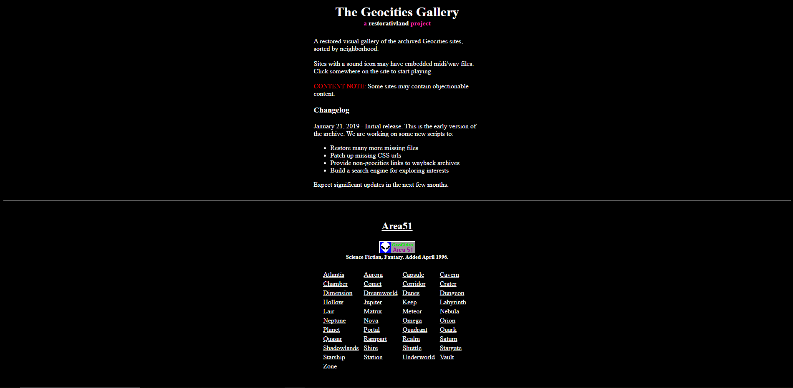
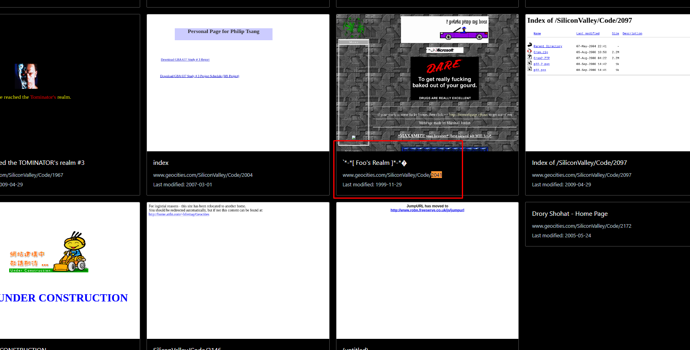
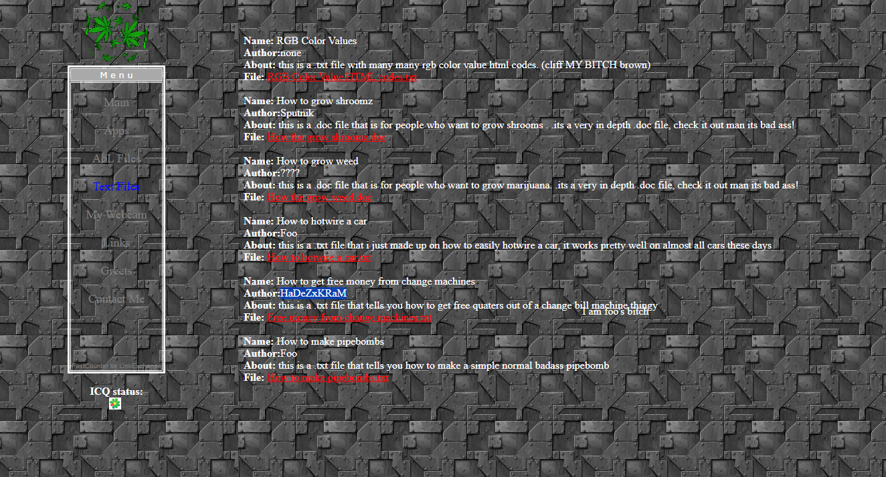

# Free Money Glitch of the Past
Category: HARD, `2000` points

I was told by Heisenberg that his accomplice is a stubborn cannabis fan. I want to know more about them, since they told me as well that they know the tricks of free money glitch! He learned it from *someone*. So, someone else might have **wrote** it. Unfortunately, I only received a **link** from Heisenberg to stress me out and give up.

[http://www.xs4all.nl/~4david/index.html](www.geocities.com/SiliconValley/Code/2041)

# Solution

1. This is a tricky problem. See the markdown link above? It's not consistent!

2. Go to the actual link (Geocities) and it will redirect you to Yahoo. Knowing that Geocities is long shutdown, the player must know how to find old websites.

3. Enter, [Web Archive](https://blog.archive.org/2009/08/25/geocities-preserved/). However, it's not even in the web archive!

4. The user must search for existing GeoCities archives aside from the Internet Web Archive. Enter, [The Geocities Gallery](https://geocities.restorativland.org/).

5. Look at the link. `www.geocities.com/SiliconValley/Code/2041` indicates that it is under SiliconValley and in Code. Checking for it:

6. Searching for the code 2041 will reveal a website:

7. Visit the website and see `Text files` link.

8. Finally, you see a title `How to get free money from change machines`, with the flag being the author.

**Flag:** `RETROTECH{HaDeZxKRaM}`