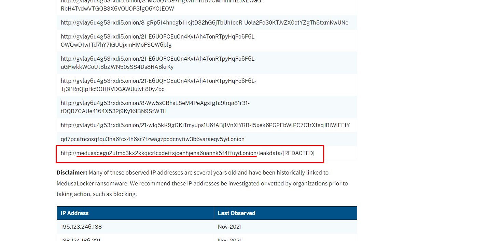

# Gorgon Ransoms
Category: AVERAGE, `999` points

Category: **OSINT**

You are to find out about an infamous ransomware variant named MedusaLocker. The flag is one of their Tor addresses. Find the flag.

Note: Finishing this challenge will unlock a follow-up challenge of Hard category.

# Solution

1. Search "MedusaLocker Tor Address" to find it quick.

2. The data is in [#StopRansomware: MedusaLocker](https://www.cisa.gov/news-events/cybersecurity-advisories/aa22-181a) article of Cybersecurity & Infrastructure Agency in USA.

3. The flag is the domain only.

**Flag:** `RETROTECH{medusacegu2ufmc3kx2kkqicrlcxdettsjcenhjena6uannk5f4ffuyd.onion}`