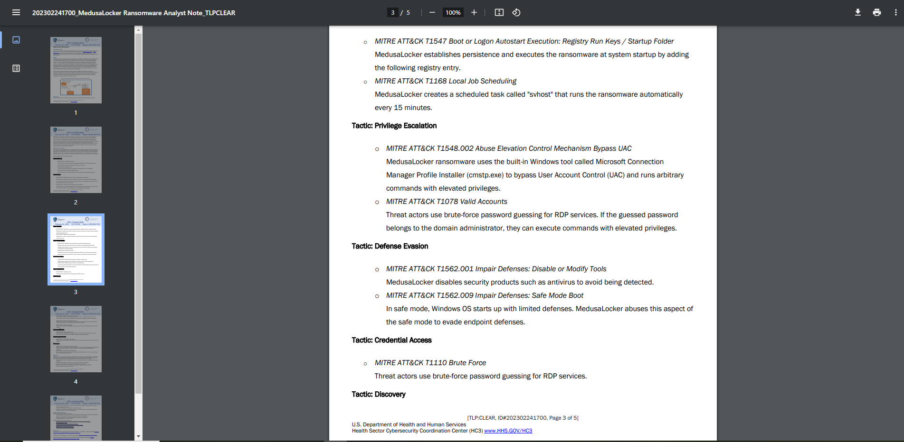

# Gorgon Ransoms
Category: AVERAGE, `999` points

Find out about MedusaLocker's wearisome defensive ploy against computer antivirus detectors. The flag is a code.

# Solution

1. This is trickier. There is only one code stated in the CISA website, but it is Impair Defenses: Safe Mode Boot. The code is an Impair Defenses: Disable or Modify Tools.

2. Finding it [somewhere in the Internet](https://www.hhs.gov/sites/default/files/medusalocker-ransomware-analyst-note.pdf) will lead them to the second defensive tactic of MedusaLocker.

**Flag:** `RETROTECH{T1562.001}`