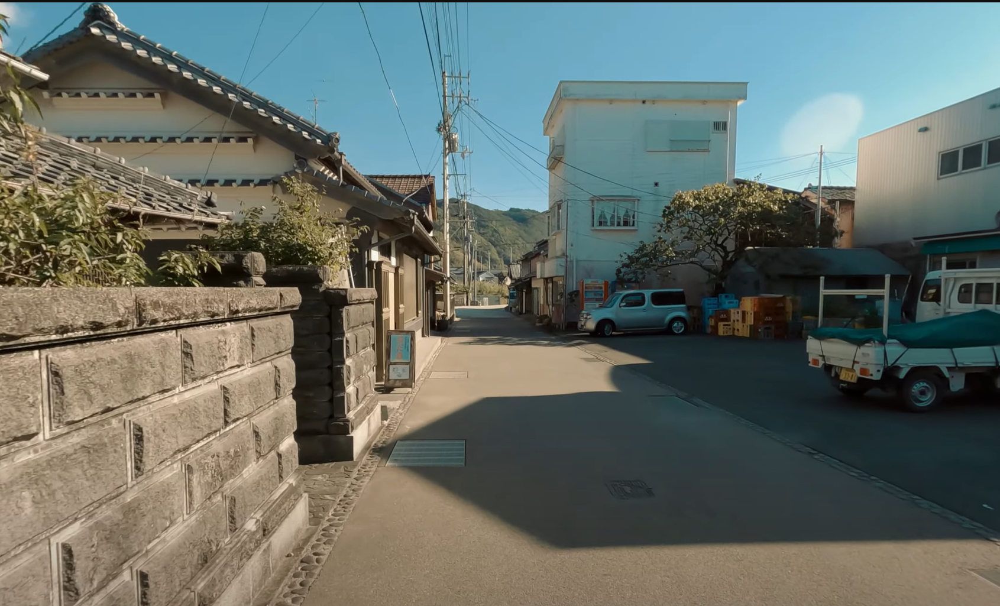
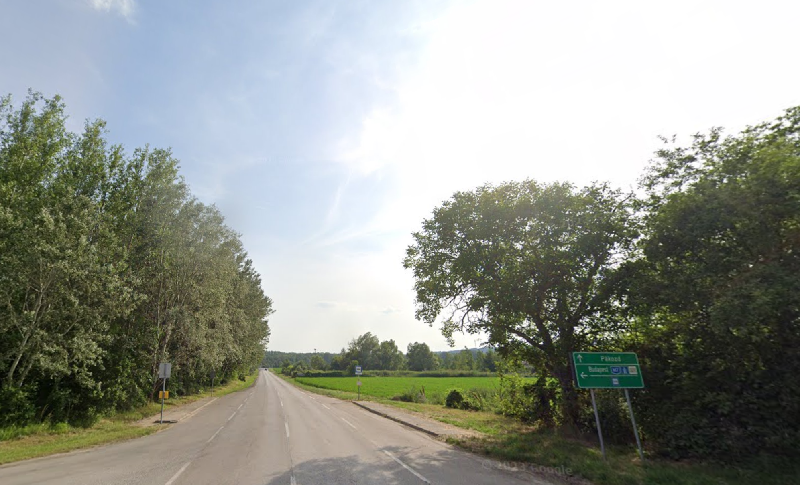
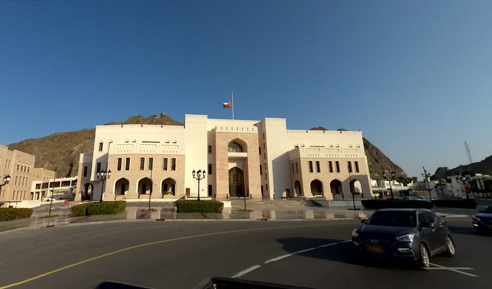
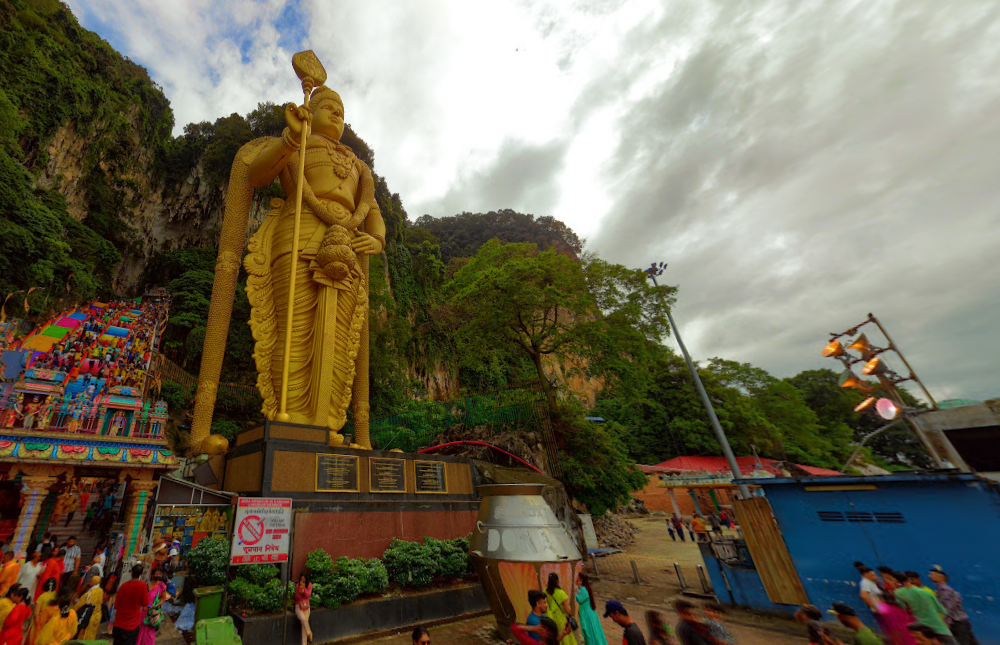
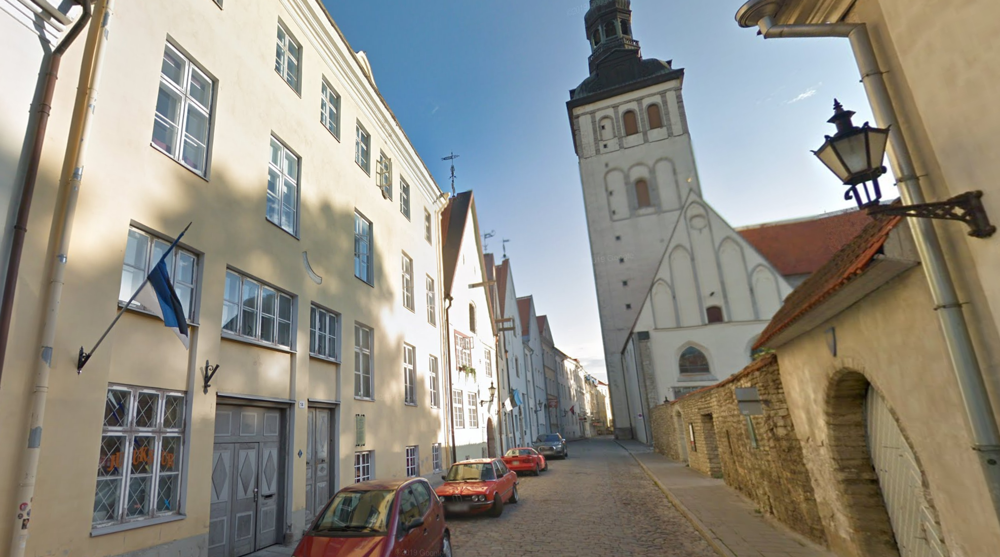
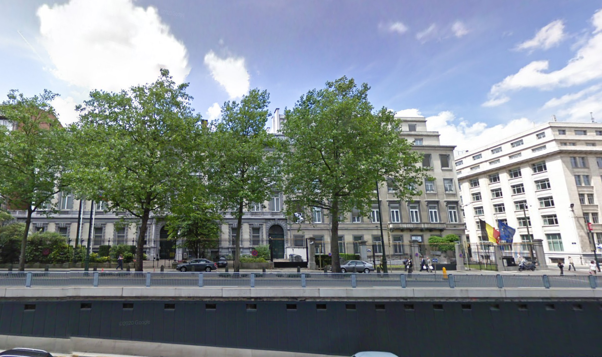
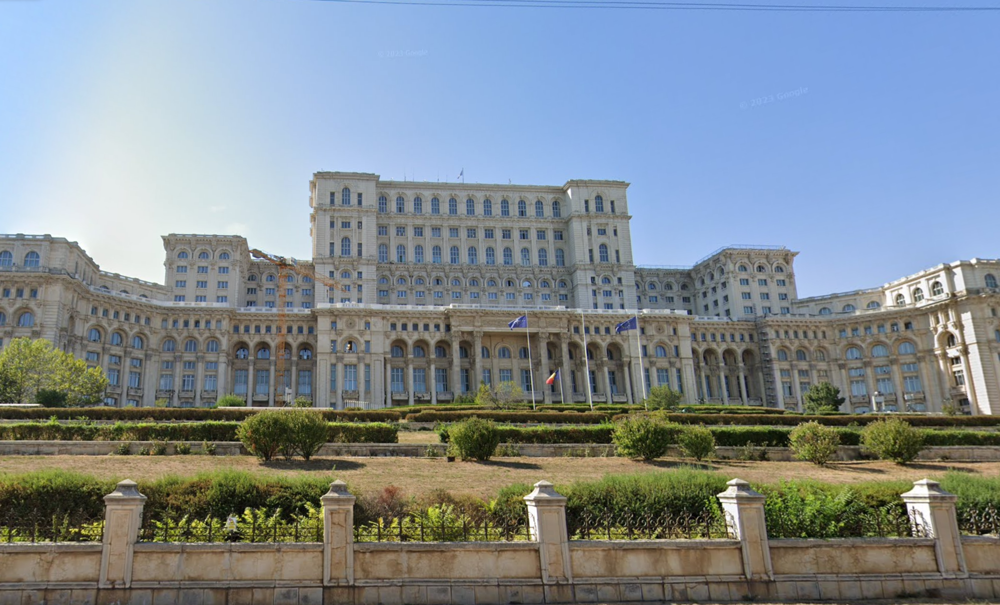
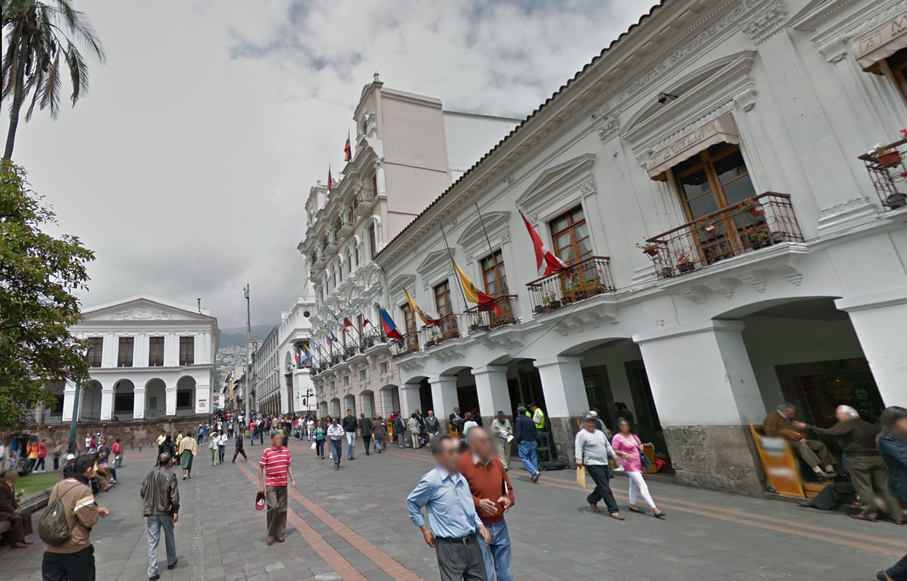
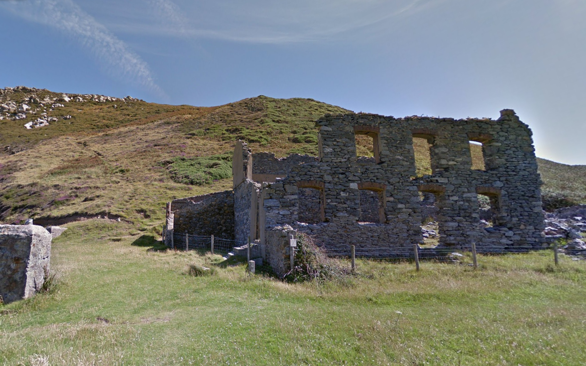
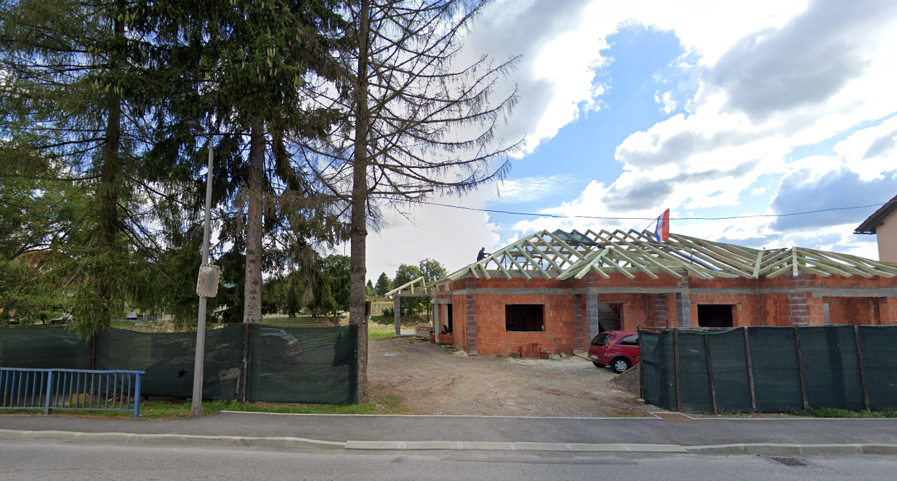

# Ruby's Geography Escapade
Category: HARD, `3199` points

Let's test your geography skills. Shall we? 

Find the *flag*.

**Reminders:**
1. Each first letter of the country you solve reveals the flag.
2. The first letter of the initial repeating letters of the flag will become number `3`.
3. Landlocked countries has the letter repeated twice, where the first letter is capitalized only.
4. Flags of countries with no symbolic animal or coat of arms has the letter capitalized.
5. Countries who have become an imperial empire before has their letters automatically become a dollar symbol.

Format: RETROTECH{flag}

> *Gamified geography problems are valuable for cybersecurity enthusiasts as they enhance Open Source Intelligence (OSINT) skills by requiring practitioners to analyze and interpret location-based data. By honing their ability to extract information from seemingly innocuous clues, enthusiasts can better understand the importance of geospatial awareness in assessing potential cyber threats and vulnerabilities.*

# Solution

1. **Japan.** Judging by the architecture of the houses, it's definitely Japan. The image is sourced in YouTube.

2. **Hungary.** Look at the signage and you can notice the "Budapest". Searching through the internet will reveal that Budapest is a city in Hungary.

3. **Oman.** This is the national museum of Oman, and you'd notice that the flag on the top of the building is the flag of Oman.

4. **Malaysia.** Come on! This is easily reverse-image-searched!

5. **Estonia.** The flag on the left, architecture of the buildings, and the church on the right side reveals that the location is somewhere in Estonia.

6. **Belgium.** (I wanna go here!) Again, the flag.

7. **Romania.** (I wanna go here as well!) This is the Palace of the Parliament. (And flag too, come on.)

8. **Ecuador.** This is the Independence Square.

9. **Wales.** Hardest one, since you can't reverse-search this (I hope). Judging by the view and atmosphere, you know that it's somewhere in Great Britain.

10. **Croatia.** Easy! See the flag? It's practically FlagGuess at this point.

**Flag**: `RETROTECH{$Hhom3BRewc}`

_It's a homage to `$ homebrew` command of UNIX-systems.The name is intended to suggest the idea of building software on the Mac depending on the user's taste._